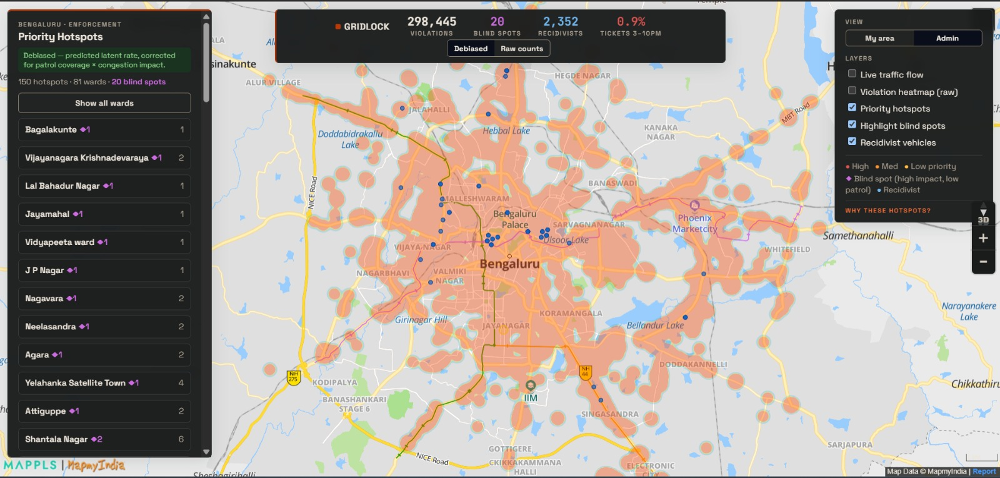
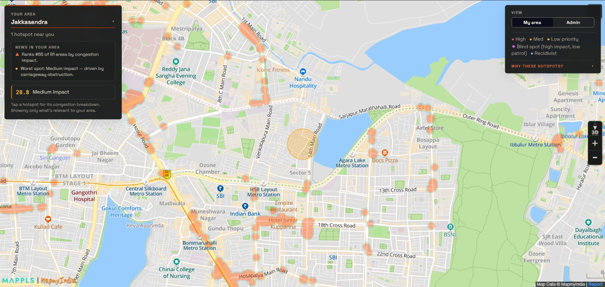

# 🚦 Visor: Parking-Induced Congestion Intelligence for Bengaluru


[](https://www.loom.com/share/12ae4597fb9f46b9b7469817b28bc647)

> Visor finds where illegal parking actually chokes traffic in Bengaluru, not just
> where police already ticket. It corrects the data for patrol bias to estimate the
> true (latent) violation rate, scores every location's Congestion Impact (0 to 100)
> with a plain-language explanation, and flags enforcement blind spots so patrols
> target where it matters most.

## 🎥 Demo video

**[▶ Watch the full demo walkthrough](https://www.loom.com/share/12ae4597fb9f46b9b7469817b28bc647)**, a guided tour of the debiased map, enforcement blind spots, and the Congestion Impact Score.

---

## 📸 The product

**Citywide enforcement console.** The full admin view turns roughly 298k raw
violations into a patrol-corrected map of latent rate times congestion impact,
with blind spots, recidivist clusters, ward priorities, and a debiased vs. raw
toggle.



**"My area" view.** The same engine at citizen and local-officer altitude. Pick a
neighbourhood and see only its hotspots, its blind spots, and how its ward ranks.
It is deliberately sparse and shows no vehicle plates.



---

## The problem

Cleaning up illegal parking sounds simple until you look at the data. A parking
violation dataset is a **patrol log, not a census of violations**. You only see a
violation where an officer happened to be, so ranking locations by raw violation
count just rediscovers existing patrol routes. The map ends up showing where
enforcement already goes, not where the real problem is.

Visor treats that bias as the core challenge rather than ignoring it. Two
structural distortions in the data are corrected before anything is ranked:

- **Temporal bias.** The raw timestamps are in UTC. Read directly, they suggest a
  midnight peak. Converted to IST, violations actually cluster from 03:00 to 12:00
  and peak around 10 to 11 AM, then fall to near zero from 3 PM to 10 PM.
  Enforcement is a morning shift, so the afternoon and evening, exactly when
  commercial parking demand is highest, is a structural blind spot.
- **Spatial bias.** About 50.4% of records come from fixed BTP cameras at
  junctions, which are unbiased. The rest come from mobile patrol, which is biased
  toward already-patrolled areas. Visor models these as two different
  observational processes instead of pooling them.

The dataset covers 298,450 parking violations from 10 Nov 2023 to 8 Apr 2024.

## How it works

```
violations -> H3 cells + 3h slots -> debiasing -> OSM features -> LightGBM -> priority score
                                        |                                       |
                                        |- inverse-probability weighting        |- latent violation rate (debiased)
                                        |- fixed-junction anchor                 \- x OSM congestion impact
                                        \- device-ID negative sampling
```

**Debiasing.** Three techniques recover the latent rate from the biased log:

- *Inverse-probability weighting.* Patrol intensity per station and hour is
  estimated from the count of distinct active device-days, and violations observed
  under light patrol are up-weighted.
- *Fixed-junction anchor.* BTP camera records are unbiased, so the model is given
  an `is_junction` signal and trusts those samples more.
- *Device-ID negative sampling.* Each officer's shift is reconstructed from
  `(device_id, date)`. Cells next to where an officer ticketed but with no
  violation become genuine "patrolled and clean" negatives, which is very
  different from "never observed".

**Features.** Road context is pulled from OpenStreetMap in a single free bounding-box
query: road class, lanes, one-way status, and traffic signals (supply); commercial,
transit, and institutional POI counts (demand); metro proximity; and spatial-lag
neighbour rates (ring-1 and ring-2).

**Model.** LightGBM with a Tweedie objective, which handles the zero-inflated
counts well. It is validated with spatio-temporal cross-validation: forward
chaining by month, with a geographic quadrant held out, so the model is tested on
its ability to generalise to under-patrolled zones rather than to re-learn patrol
routes.

**Outputs.**

- `priority_score`, the normalised latent rate multiplied by OSM road criticality.
- A **blind-spot detector** that flags locations with high predicted impact but
  low observed patrol.
- **Recidivist clusters**, vehicles with six or more violations concentrated at one
  location, which typically indicate fleets or auto stands.

## How congestion is measured: the Congestion Impact Score

Every hotspot receives an explainable Congestion Impact Score from 0 to 100 and a
Low / Medium / High / Critical class. The score is the sum of four stored,
weighted subscores, each visible in the UI so the result is never a black box:

`CIS = 100 x (0.30·VLS + 0.20·COS + 0.35·ECS + 0.15·RPS)`

- **VLS, violation load.** The debiased latent rate multiplied by mean violation
  severity (vehicle type and offence code), so it does not re-inherit patrol bias.
- **COS, carriageway obstruction.** How much road a parked vehicle actually steals:
  parked-vehicle width times concurrency, divided by the road width from OSM. The
  same vehicle scores far higher on a narrow lane than on a wide one.
- **ECS, excess congestion.** The live speed deficit versus the road's normal
  speed. In batch mode, with no live feed, it uses an OSM demand-times-capacity
  proxy flagged `low_confidence`. A Mappls Flow feed drops in through the
  `ECSProvider` interface with no other change.
- **RPS, recurrence.** The number of days with a violation in the trailing 30.

Because congestion impact is computed per location from real road geometry and
traffic rather than assumed, Visor can point at a specific corner and explain how
much it is hurting flow and why.

A Phase-2 trained classifier (LightGBM with SHAP and probability calibration) swaps
in behind the same contract once at least three months of measured-delay outcomes
exist; the interface is already stubbed in the pipeline. For this dataset,
`duration_factor` is dropped because `closed_datetime` is entirely null, and ECS
uses the proxy described above.

Serve it: `cd api && pip install -r requirements.txt && uvicorn main:app --port 8000`.
`GET /hotspots/{id}` returns the full score contract (see `api/README.md`).

## Why these hotspots exist: socio-economic drivers

A hotspot map answers *where*. This layer answers *why*. `socioeconomic_insights.py`
joins each hotspot to proxies for three socio-economic dimensions and quantifies how
each relates to parking pressure and congestion impact:

- **Economic activity and income**, from commercial-POI density (and VIIRS
  night-light radiance when a raster is supplied via `viirs_equity.py`).
- **Proximity to social centres**, from institutional POIs (schools, hospitals,
  places of worship), transit, and metro stations within 500 m.
- **Infrastructure**, from OSM road capacity (throughput times lanes).

Findings on the full dataset (`insights.json`):

| Hotspots near | CIS vs. elsewhere |
|---|---|
| Commercial centres | **2.84x** (12.2 vs. 4.3) |
| Transit hubs / metro within 500 m | **2.61x** (13.9 vs. 5.3) |
| Schools / hospitals / worship | **1.99x** (10.8 vs. 5.5) |

The strongest single correlate of congestion impact is road capacity (r = +0.45
with CIS), followed by metro proximity (+0.38) and commercial density (+0.34). In
other words, illegal parking bites hardest where high-capacity roads meet dense
activity. The equity question (whether richer wards are over- or under-enforced at
equal road criticality) plugs in directly once a VIIRS radiance layer is added; the
ward join is already wired in `viirs_equity.py`.

### Per-hotspot interpretability

`socioeconomic_insights.py` explains the aggregate pattern. `hotspot_interpreter.py`
explains one hotspot at a time. For each high-CIS cell it assembles a structured
evidence profile and turns it into a plain-language hypothesis:

- **Place character**, the named OSM POIs within 300 m (temple, mall, market,
  school, hospital, metro, office) and a dominant primary type.
- **Infrastructure**, the road class, lanes, surface, and street lighting, plus the
  demand-versus-capacity ratio (is the road under-provisioned for the activity
  around it?).
- **Income proxy**, the commercial-POI density percentile, blended with VIIRS ward
  radiance when available. It is explicitly labelled a proxy, since the data carries
  no per-capita income.

The reason text is generated by Gemini (set `GEMINI_API_KEY`), grounded only in that
evidence. With no key, or on any API error, it falls back to a deterministic
rule-based explanation, so it always runs, free and offline, like the rest of the
pipeline. Output: `hotspot_interpretations.json`.

```bash
cd model
export GEMINI_API_KEY=...                  # optional; omit for rule-based reasons
python hotspot_interpreter.py --limit 50   # add --no-llm to force rule-based
```

Example output (real data, Jayamahal): *"CIS 66.8 (High) likely because it draws
concentrated demand from a place of worship (Jayamahal Shani Mandir) nearby, and a
narrow ~2-lane carriageway..."*

## The two views

The same engine is presented at two altitudes, and both views are shareable by URL.

- **Admin** is the full citywide console: every layer, the debiased vs. raw toggle,
  recidivist vehicles, and ward-level enforcement priorities.
- **My area** is for a citizen or a local officer: pick your area and see only your
  hotspots, your blind spots, and your ward's rank. No vehicle plates are shown.

Map features include live traffic flow, a raw violation heatmap, the debiased vs.
raw before-and-after toggle, priority hotspots coloured by score, blind spots
(magenta ring), recidivist vehicles (blue), a per-hotspot CIS breakdown, and a ward
"Enforcement Priorities" panel.

## Quick start

The map ships with precomputed data in `frontend/public/`, so only the frontend is
needed to see the full demo.

```bash
# 1. Map (required)
cd frontend
npm install                       # first time only
cp .env.example .env.local        # then paste your Mappls token into .env.local
npm start                         # opens http://localhost:3000
```

> The Mappls token is read from the environment, not the source. Put
> `REACT_APP_MAPPLS_TOKEN=...` in `frontend/.env.local` (gitignored) for local dev,
> or set it in your host's environment (for example Vercel, Settings, Environment
> Variables). Without it the map loads blank. Tokens expire in about 24h; regenerate
> at apis.mappls.com. Create React App reads `REACT_APP_*` vars only at build/start
> time, so restart `npm start` after editing `.env.local`.

```bash
# 2. CIS API (optional; serves the score contract per hotspot)
cd api
pip install -r requirements.txt
uvicorn main:app --port 8000      # docs at http://localhost:8000/docs
```

```bash
# 3. Retrain or regenerate data (optional)
#    Open model/gridlock_colab.ipynb in Colab, Run all, download outputs/*.json
#    into frontend/public/. Or locally:
python -m venv .venv && . .venv/Scripts/activate
pip install -r model/requirements.txt
cd model && GRIDLOCK_CSV="../<violations>.csv" python gridlock_pipeline.py
cp outputs/*.json ../frontend/public/
```

Developer tips: set `GRIDLOCK_SAMPLE=0.05` for a fast local smoke test, or
`GRIDLOCK_OSM=0` to skip OSM. The pipeline `.py` and the Colab notebook are the same
code; edit the `.py`, then run `python model/make_notebook.py` to regenerate the
notebook.

## Architecture

```
model/      ML pipeline and Colab notebooks (the intelligence layer)
  gridlock_pipeline.py       source of truth: debiased model + CIS engine
  gridlock_colab.ipynb       generated notebook, upload to Colab to train
  stgcn_pipeline.py          STGCN ensemble (graph conv + GRU); stgcn_colab.ipynb
  patrol_routing.py          shift-optimal patrol routes (greedy set cover)
  cis_phase2_train.py        Phase-2 calibrated classifier training harness
  baseline_store.py          rolling 8-week ECS baseline accumulator
  db.py / scheduler.py       SQLite persistence + interval recompute
  viirs_equity.py            ward-level equity analysis (VIIRS radiance optional)
  socioeconomic_insights.py  the aggregate "why": income, social-centre, infra drivers
  hotspot_interpreter.py     the per-hotspot "why": LLM reason from local evidence
  make_notebook.py           regenerates .ipynb from any cell-marked .py
api/        Read-only FastAPI service over the CIS scores (optional DB, live ECS)
backend/    Legacy descriptive pipeline (Mappls live-traffic enrichment)
frontend/   React + Mappls map: priority hotspots, blind spots, recidivists, CIS
```

## Roadmap

**Done**

- [x] H3 indexing and UTC to IST temporal fix
- [x] Debiasing: IPW, fixed-junction anchor, device-ID negative sampling
- [x] OSM feature enrichment (roads, POIs, metro)
- [x] LightGBM latent-rate model with spatio-temporal CV and SHAP
- [x] Enforcement blind-spot detector and recidivist-vehicle clustering
- [x] Congestion Impact Score (Phase-1 rule classifier) with explanations
- [x] Read-only CIS API (FastAPI) with optional SQLite-backed serving
- [x] React map: hotspots, blind spots, recidivists, CIS panel, before/after toggle
- [x] Shift-optimal patrol routing (`patrol_routing.py`), runs on real data
- [x] STGCN ensemble (`stgcn_pipeline.py`, `stgcn_colab.ipynb`): graph conv + GRU
- [x] Persistence and scheduler (`db.py`, `scheduler.py`): SQLite + interval recompute
- [x] VIIRS equity analysis (`viirs_equity.py`): spatial half runs today
- [x] Phase-2 training harness (`cis_phase2_train.py`): calibration and SHAP
- [x] 8-week ECS baseline accumulator (`baseline_store.py`) with live-ECS API wiring
- [x] Aggregate socio-economic insight engine (`socioeconomic_insights.py`)
- [x] Per-hotspot interpreter (`hotspot_interpreter.py`): Gemini reason, rule-based fallback

**Ready, pending external data inputs.** Each mechanism is in place and activates as
soon as its input is available:

- [ ] Live Mappls Flow feed for ECS. Requires a Mappls token (`MAPPLS_TOKEN`); until
      then ECS uses the OSM proxy flagged `low_confidence`.
- [ ] 8-week baseline values. Require about eight weeks of live polling to
      accumulate; the store and decay logic are done and cannot be backfilled from
      history.
- [ ] Phase-2 real labels. Require at least three months of measured-delay outcomes;
      the harness trains today on a placeholder label and swaps in real ones via the
      `outcome_class` column.
- [ ] VIIRS radiance. Requires a NASA Earthdata GeoTIFF (`--viirs`); the ward join
      and equity report are done and run without it.

**Future work**

- **Parking-angle aware COS.** COS currently assumes parallel parking. A large share
  of Bengaluru violations, especially outside shops, are perpendicular or angled and
  consume two to three times the carriageway depth. A parking-angle feature from OSM
  (the `parking:lane` tag where present, otherwise a heuristic from junction
  proximity and road class) would make obstruction reflect the real footprint.
- **Recency-weighted RPS.** RPS currently counts trailing-30-day violation days
  uniformly, so a zone that was clean for three weeks then hit daily scores the same
  as one with 30 sporadic hits. Exponential decay, `RPS = sum(exp(-lambda * d_i)) /
  normaliser` where `d_i` is days since violation, makes RPS track recency and decay
  after a successful crackdown, rewarding enforcement.
- **Weather and events features.** Hourly rainfall (free historical) shifts both the
  violation rate (patrols shelter) and congestion impact (wet roads lose effective
  speed per unit blockage). A holiday and event calendar would explain much of the
  remaining temporal variance.
- **Ensemble blend in production.** STGCN predictions are already exported; blending
  them with the LightGBM latent rate into the live priority score is a small wiring
  step.

## Data sources

- Violations CSV, organiser-provided (gitignored, not committed).
- Road network and POIs, OpenStreetMap via OSMnx and Overpass (free).
- BBMP ward boundaries, public DataMeet / Open City GeoJSON (`backend/BBMP.geojson`).
- Live traffic (optional map layer), Mappls Web Maps SDK.
